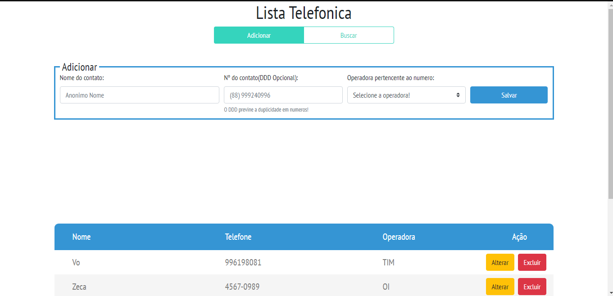
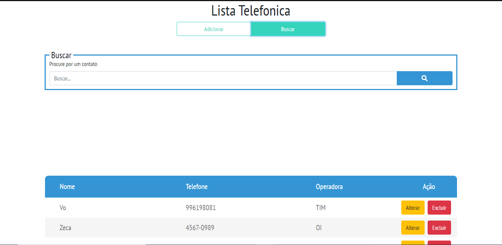
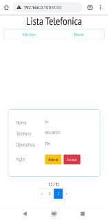
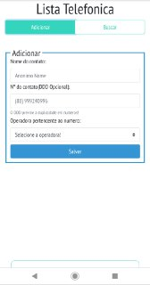
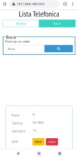

<h1 style='text-align:center;'>Projeto Lista Telefonica</h1>

## Autor
<h4><a href="https://github.com/Tiago-Alves-dos-Santos">Tiago-Alves-dos-Santos</a></h4>
## Sobre o sistema Lista Telefonica

O sistema Lista Telefonica, em resumo, serve para salvar e gerenciar seus contatos! 

### Tecnologias Usadas
<ol>
<li>Laravel / Blade</li>
<li> Sass / BootStrap 4 </li>
<li>Jquery / Ajax</li>
<li>Mysql</li>
</ol>

## Imagens do projeto

#### Desktop(WEB)
<table>
   <tr>
       <td>Tela Inicial</td>
       <td>Adcionar Contato</td>
       <td>Buscar Contato</td>
   </tr>
    <tr>
        <td style="width:400px"></td>
        <td style="width:400px"></td>
        <td style="width:400px"></td>
   </tr>
</table>

#### Aplicação Celular(Mobile) 
<table>
   <tr>
       <td>Tela Inicial</td>
       <td>Painel de Controle</td>
       <td>Tela Desenvolvedores</td>
   </tr>
    <tr>
       <td style="width:400px"></td>
       <td style="width:400px"></td>
       <td style="width:400px"></td>
   </tr>
</table>

## Como rodar o sitema localmente

### Requisitos para o sistema rodar no sua maquina

<ol>
    <li>php >= 7.1, use o <a href="">xampp</a></li>
    <li>Node js e Npm <a href="https://nodejs.org/en/">instalados na maquina</a></li>
</ol>

### Explicando as etapas

Após estar com o projeto em sua maquina você devera acessar a pasta do sistema pelo terminal e executar os comandos abaixo para instalar a node_modules:

<ol>
    <li>npm install</li>
    <li>npm install -g cross-env</li>
</ol>

Apos executar os comandos acima, entre no seu SGBD crie um banco de dados com nome 'lista-telefonica' e faça a importação do arquivo 'banco/lista-telefonica.sql' para o mesmo. Caso altere o nome do banco ou seus dados locais possuem alguma confifuração diferente do padrão configure o arquivo '.env' 

