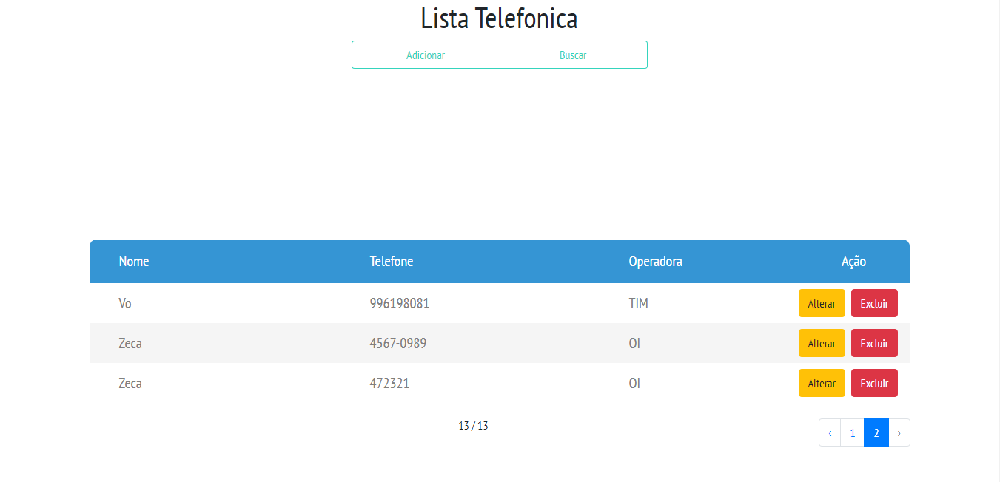

<h1 style='text-align:center;'>Projeto Lista Telefonica</h1>

## Autor

## Sobre o sistema Lista Telefonica

 Nesse espaço colocaremos uma descrição, quando tivermos mais tempo! link de acesso: <a href="">Lista Telefonica</a>

### Tecnologias Usadas

 Em resumo para o desenvolvimento deste projeto foi usado o frameork laravel como artesão da web em conjuntos com outras tenologias como o BootStrap 4, Jquery, Blade entre outras!</a>

## Imagens do projeto

<!-- #### Desktop(WEB)
<table>
   <tr>
       <td>Tela Inicial</td>
       <td>Painel de Controle</td>
       <td>Tela Desenvolvedores</td>
   </tr>
    <tr>
        <td style="width:400px"></td>
        <td style="width:400px"></td>
        <td style="width:400px"></td>
   </tr>
</table>

#### Aplicação Celular(Mobile) 
<table>
   <tr>
       <td>Tela Inicial</td>
       <td>Painel de Controle</td>
       <td>Tela Desenvolvedores</td>
   </tr>
    <tr>
       <td style="width:400px"></td>
       <td style="width:400px"></td>
        <td style="width:400px"></td>
   </tr>
</table> -->

## Como rodar o sitema localmente

Ao fazer o clone do projeto ou apenas o download você devera acessar a pasta do sistema pelo terminal e executar os comandos abaixo para instalar a node_modules:

<ol>
    <li>npm install</li>
    <li>npm install -g cross-env</li>
</ol>

Apos executar os comandos acima, entre no seu SGBD crie um banco de dados com nome lista-telefonica e faça a importação do arquivo banco/lista-telefonica.sql para o mesmo. Caso altere o nome do banco ou seus dados locais possuem alguma confifuração diferente do padrão configure o arquiv .env 
